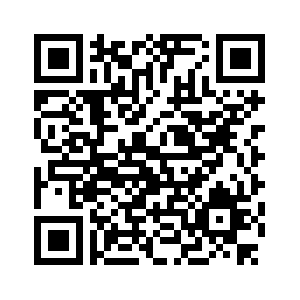
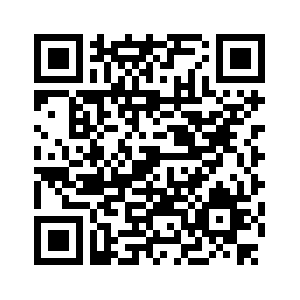

Sensor Logging Demonstration
============================
[Serval Project][], November 2012.

These are instructions for demonstrating the prototype Sensor Logging
capability of the [Serval Mesh][] app for Android.

Overview
--------

The sensor logging capability is designed to continuously record the physical
movement of several subjects, and periodically transmit the records to a
central collection point, from which they can be collated and analysed.  The
transmission does not require continuous Internet connection, so subjects are
free to roam throughout the day, as long as they spend a few minutes each day
within range of a WiFi access point or of another device participating in the
study.

Each subject carries an Android phone with two apps installed:

 * The [sensor-logger][] app reads the phone's built-in accelerometer five times a
   second and appends the readings to a log file.  Every hour it injects the
   log file into [Rhizome][] and starts a new file.

 * The [Serval Mesh][] app runs the [Rhizome][] file distribution service,
   which stores all files that have been injected to date and exchanges them
   over WiFi with any other phone that comes into range.  It periodically
   attempts to upload all files it carries (including those received from other
   phones) to a central server.  The upload will work whenever it is within
   range of a WiFi access point or if the phone has a SIM chip and the
   subscriber has a mobile data plan.

The demonstration uses a prototype of the software which is sufficient to prove
the concept but unsuitable for deployment with real subjects.  Many steps that
should be automatic must be performed manually for the demonstration.

Assumed knowledge
-----------------

The commands in this document are [Bourne shell][] commands, using standard
quoting and variable expansion.  Commands issued by the user are prefixed with
the shell prompt `$` to distinguish them from the output of the command.
Single and double quotes around arguments are part of the shell syntax, not
part of the argument itself.

These instructions assume the reader is proficient in the Unix command-line
shell, and is experienced with the Internet, WiFi networking, USB devices,
Android smartphones, software installation and administration, and
troubleshooting.

Requirements
------------

For the demonstration, you will need:

 * at least two Android devices (phones) which have been [rooted][], and
   preferably with a QR code reader app installed;
 * a workstation (eg, laptop);
 * a USB cable for connecting an Android device to the workstation.

The workstation will be used at the end of the demo to fetch sensor log files
from the central server via an Android device, so they can be inspected.

Install Serval Mesh on an Android device
----------------------------------------

The [Serval Mesh][] Android app must be installed on all the Android devices
(phones) used in the demo.

Download the [Serval Mesh][] app onto each Android device from
<https://github.com/downloads/servalproject/batphone/batphone-sensorlog.apk>
and install it.  The following QR code is a convenient way to do this, if
the device has a QR reader app:

Install Sensor Logger on an Android device
------------------------------------------

The [sensor-logger][] app must be installed on all the Android devices (phones)
that will be used to generate the logs.  In a real-world deployment, these would
be the phones carried by the subjects.

Download the Sensor Logger app onto each Android device from
<https://github.com/downloads/servalproject/sensor-logger/sensor-logger.apk>
and install it.  The following QR code is a convenient way to do this, if
the device has a QR reader app:

Start recording movement of an Android device
---------------------------------------------

On the device, start the “Serval Mesh” app.  The first time you start it after
installation, it will turn OFF the device's WiFi and Switch itself ON
automatically, which puts its WiFi radio into AdHoc mode and cuts off Internet
access via WiFi.  To recover normal WiFi networking, press the “Switch OFF”
button on the Serval Mesh main screen, then go to the Android main Settings
“Wireless & networks” menu and switch WiFi back on.  All subsequent times that
the Serval Mesh app is started, it will be switched OFF, which is how it should
remain for the demo.

On the device, start the “Movement Sensor” app and press its “Start” button.
The app will start recording the device's accelerometer readings into a log
file.  After 60 minutes have elapsed, the app will inject the log file into
Rhizome and start a new file.  This will repeat indefinitely until logging is
stopped by pressing the “Stop” button or the app is forcibly terminated or the
phone is shut down.

When you press the “Stop” button, the app stops logging and injects the current
log file into Rhizome.  This provides a convenient way to run quick tests.

If the app is forcibly stopped or the phone is shut down, the current log file
will be lost.

Upload movement logs to Serval HQ
---------------------------------

On the device, start the Serval Mesh app and check that it is switched OFF: the
lower centre button should have a dark background and the caption “Switch ON”.

Ensure that the device has Internet access, either through a mobile carrier
data plan (an installed SIM) or WiFi network access.

In the Serval Mesh app main screen, press the “Share Files” button to go to the
Share Files screen.

On the Share Files screen, press the MENU button and a menu should pop up with
two buttons: “Push” and “Sync”.  Press the “Push” button.  The upload should
complete within several seconds, or possibly a minute or two, depending on the
speed of the phone's Internet access.  There is nothing to indicate that the
upload is in progress or when it finishes, nor whether it succeeded or failed.

Extract log files from Serval HQ
--------------------------------

Follow the same procedure as for sending logs to Serval HQ (above) but press
the “Sync” button instead of “Push”.

The device will download all the log files that it does not already have.  This
could take several seconds or up to a minute or two, depending on the speed of
the phone's Internet access.  There is nothing to indicate that the download is
in progress or when it finishes, nor whether it succeeded or failed.  If it
succeeds, then newly downloaded files will appear in the “Find” screen.

Once the sync is complete, press the “Find” button on the Share Files screen.
This will list all the log files that have been received (and generated) by the
device.  They can be extracted one by one by selecting each file in turn and
pressing the “Save” button in its pop-up dialog box.

Once all files are extracted, they can be transferred to the workstation by
connecting the Android device to the workstation via USB in *storage* mode.
The extracted files will be on the USB volume in in the directory
`/Android/data/org.servalproject/files/rhizome/saved`.  Simply copy them to a
directory on the workstation.

[Serval Project]: http://www.servalproject.org/
[Serval Mesh]: ../README.md
[INSTALL.md]: ../INSTALL.md
[batphone]: http://github.com/servalproject/batphone/
[sensor-logger]: https://github.com/servalproject/sensor-logger/
[CSEM]: http://www.flinders.edu.au/science_engineering/csem/
[Rhizome]: http://developer.servalproject.org/dokuwiki/doku.php?id=content:technologies:rhizome
[rooted]: http://lifehacker.com/5789397/the-always-up+to+date-guide-to-rooting-any-android-phone
[Bourne shell]: http://en.wikipedia.org/wiki/Bourne_shell
